<h1 align="center">  청진음을 이용한 Abnormal Lung Sounds Object Detection </h1>
<h3 align="center"> 팀 소깎사 </h3>
<h5 align="center"> 조혜원 | 장태욱 | 옥창우 | 이승제 </h5>
<h5 align="center">
모두의 연구소 AIFFEL X 스마트사운드 
<!--
청진음을 이용한 Abnormal Lung Sound(crackles, wheezes) Object Detection 
-->

</h5>
 

<!-- github pdf link-->
[ [발표자료 PDF](https://github.com/team-Sogaksa/Respiratory_CL/blob/main/%E1%84%89%E1%85%A9%E1%84%81%E1%85%A1%E1%86%A9%E1%84%89%E1%85%A1_%E1%84%91%E1%85%B3%E1%84%85%E1%85%A9%E1%84%8C%E1%85%A6%E1%86%A8%E1%84%90%E1%85%B3%20%E1%84%87%E1%85%A1%E1%86%AF%E1%84%91%E1%85%AD_%E1%84%8E%E1%85%AC%E1%84%8C%E1%85%A9%E1%86%BC.pdf) ]
<!-- 발표 유튭링크 -->
https://youtu.be/ct-0Zc4Qdw0?si=k-j_Om-AjDPqpmao

<!-- pdf title -->
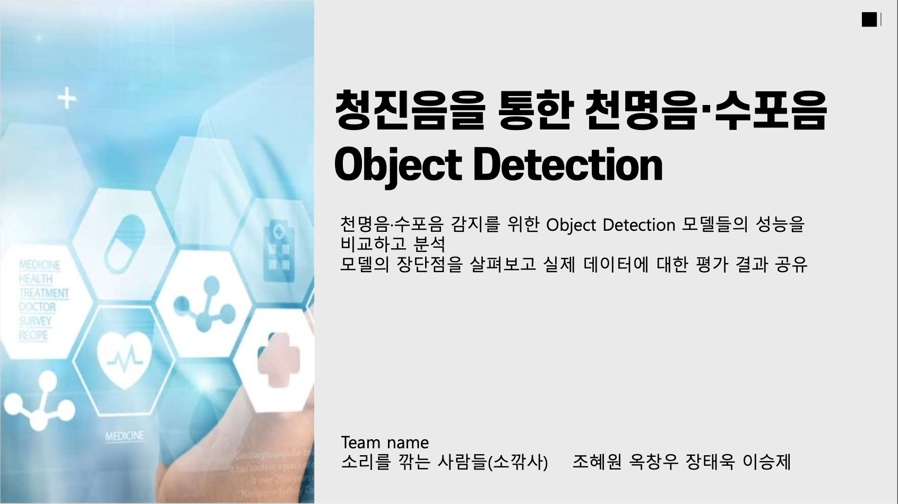

## Description

- 진행기간: 24.02 ~ 04
- 개발 목적: 호흡음 데이터를 기반으로 정상음과 비정상음을 감별하여 호흡수와 비정상음 판별
- 개발 개요:
  
  호흡음은 공기의 흐름, 폐 내부의 조직 변화, 폐 내 분비물의 위치와 직접적인 관련이 있어 호흡기 건강 및 호흡기 질환의 중요 지표로 사용됩니다. 
  증상의 위험성으로는 이러한 호흡들이 폐질환과 관련이 있으며 삶의 질, 건강의 문제로 이어 질 수 있습니다. 
  저희 조는 이런 이상 호흡들의 조기진단과 실시간 모니터링, 효율적 치료를 목적으로 하고자 [ICBHI 2017 Challenge Respiratory Sound Database](https://bhichallenge.med.auth.gr/ICBHI_2017_Challenge)를 이용해 객체 탐지 모델 구축 및 평가를 진행하였습니다. 
- 과정: EDA > 전처리 > bbox 추출 > 모델링 > 결과 확인

<!--
## About Aiffelthon
**<평가 방식>** 

 
- 다양한 모델 적용 후,  데이터에 대한 결과 비교
- 과업 : 수포음(crackle)과 천명음(wheeze) 확인과 호흡 개수 확인.
-->

---

## 1. Dataset 

- 데이터셋: [ICBHI 2017 Challenge Respiratory Sound Database](https://bhichallenge.med.auth.gr/ICBHI_2017_Challenge) 
- 10초에서 90초의 920개의 녹음 파일(126명의 환자) 수록
- 각각의 녹음 파일에 대한 주석이 포함됨
- 6898개의 호흡 주기를 포함해 총 5.5시간 분량의 녹음 기록
- 1864개에는 수포음(crackle), 886개에는 천명음(wheeze), 506개에는 수포음(crackle) 와 천명음(wheeze) 이 모두 포함되어 있음.
- 데이터에는 깨끗한 호흡음만을 포함한 녹음 파일과 실제 생활 조건을 반영해 소음이 포함된 녹음 파일이 있음. 
- 환자는 모든 연령대를 포함  
  > `crackle`: 기포가 작은 공기 통로를 통과하면서 만들어내는 딱딱거리는 소리 
  > `wheeze`: 좁아진 통로를 공기가 지나가면서 내는 휘파람같은 소리
  >
  >  |lung sound: |Normal|Crackle|Wheeze|
  >  |---|---|---|---|
  >  |frequency|50-2500 Hz|100-200 Hz|100-2500 Hz|
  >  |duration||< 20 ms|> 80ms|
  >
  >  reference: [Analysis of Respiratory Sounds: State of the Art](https://www.ncbi.nlm.nih.gov/pmc/articles/PMC2990233/)
  >  (소리의 특징은 질환, 환자의 상태 등 상황에 따라 충분히 달라질 수 있음)

<!--
- `wheeze` - High-pitched, **100 -2500Hz**의 주파수 대역과 **80msec 이상의 지속시간**
- `crackle` - High-pitched, crackle의 **지속시간**은 **20 ms보다 더 낮고** 주파수 대역은 **100와 200 Hz** 사이
-->

 

## 2. Preprocessing

- sampling(8000Hz)
- 5th Butterworth filter: RespireNet 참고
- split audio length: 7seconds 
- zero padding: audio segments length under 7s

  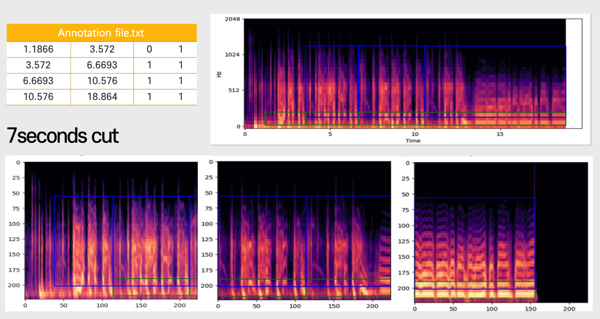
  
<!--

  

-->
<!-- preprocessed image -->

 

## 3. Labeling & Feature extraction

- Mel feature extraction: spectrogram parameters는 [RespireNet](https://github.com/microsoft/RespireNet/blob/main/utils.py)을 참고, 이후 실험적으로 표현 좋은 해상도로 각 값들을 결정
- Bounding box 좌표값 결정: annotation정보를 통해, `width`는 호흡 주기, `height`는 [Analysis of Respiratory Sounds: State of the Art](https://www.ncbi.nlm.nih.gov/pmc/articles/PMC2990233/)를 참고하여 해당 표현이 나타날 수 있는 값으로 결정
- 비교를 위해 두 가지 조건 설정 : 1. class마다 다른 `y`값 / 2. 모든 class가 같은 `y`값
  
  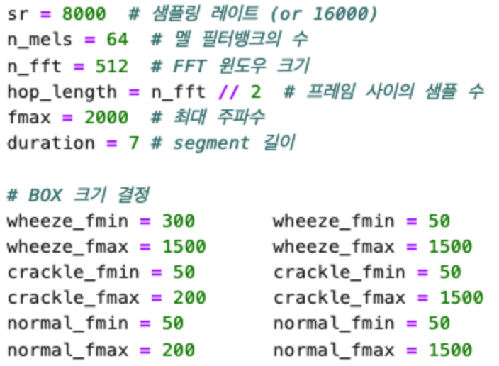
      
- 결정된 bbox값으로 xml 데이터 생성

  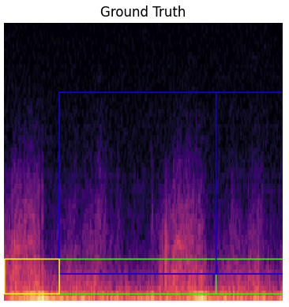
  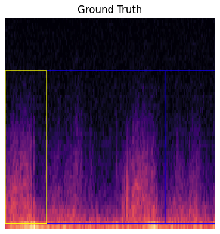
  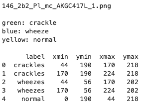

 

## 4. Modeling, Training

모델링(COCO-pretrained)

- [Faster RCNN]() [Torchvision](https://pytorch.org/vision/main/models/faster_rcnn.html)
  
  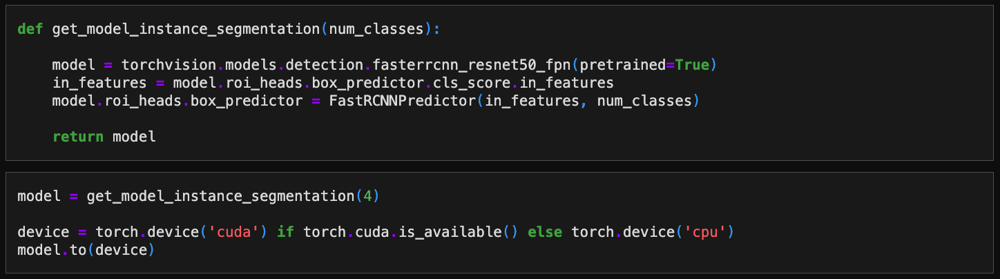

- [YOLO v8]() [Ultralytics](https://docs.ultralytics.com/)

  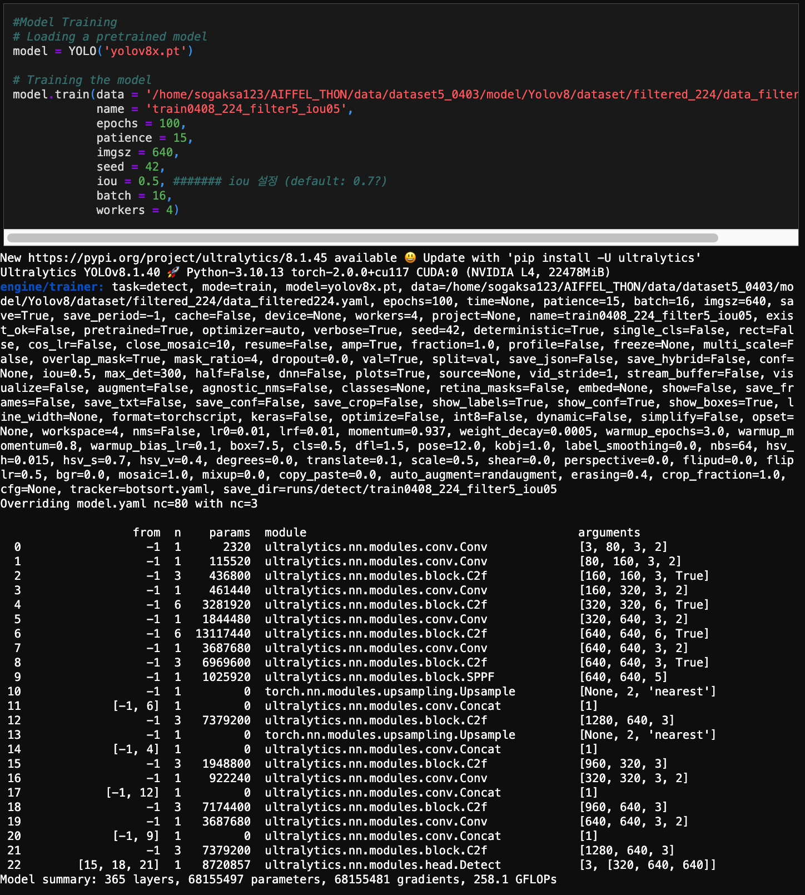

 

## 5. Result
<!--
1) Task 1 : crackle wheeze object detection 

2) Task 2 : breathing counts

-->

- 조건에 따른 mAP값 비교
  
  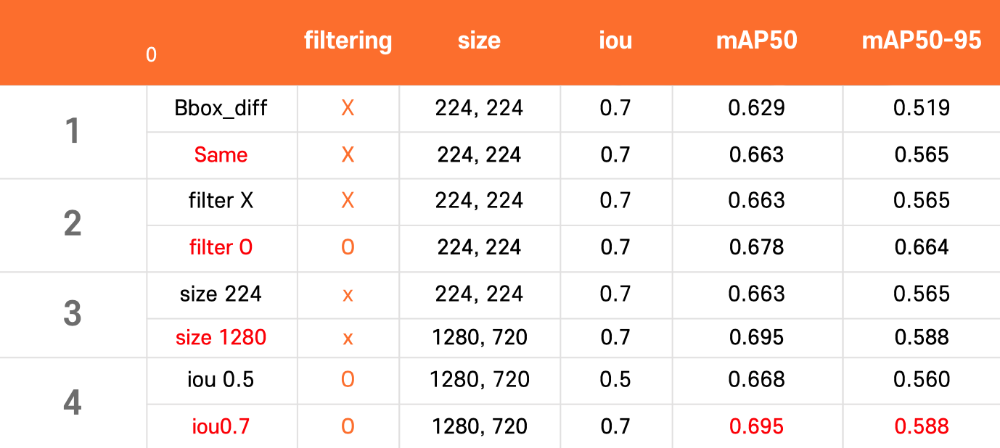

- YOLOv8 model sample inference
  
  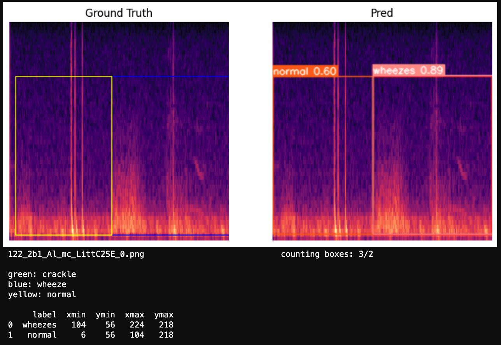

### YOLOv8 validation result 

- labels
  
  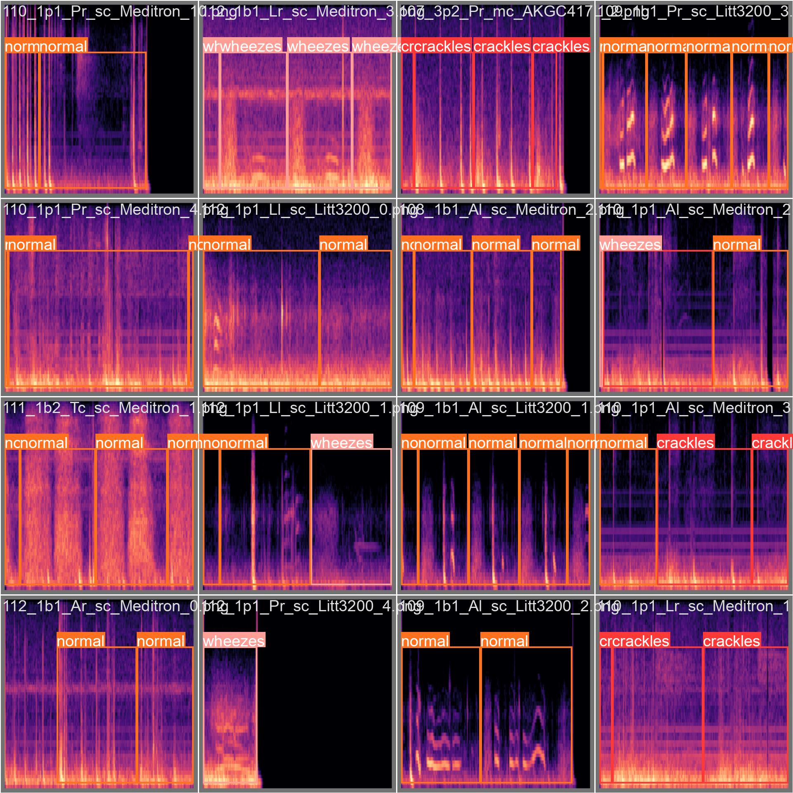

- pred

  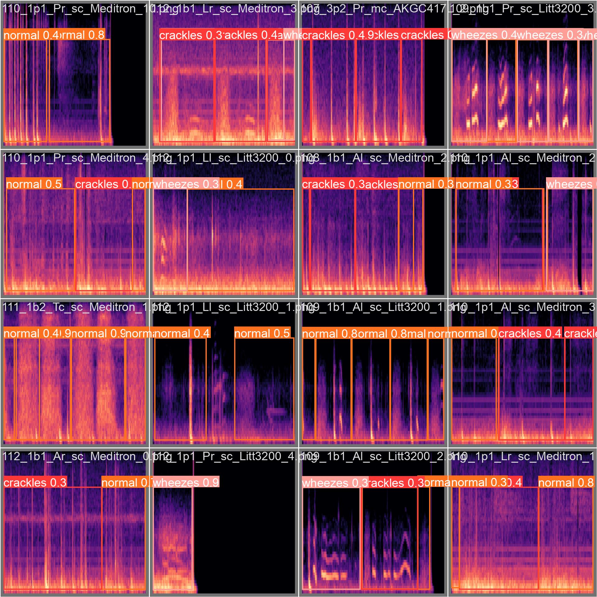
  

<!-- 
## 6. 추가 실험 내용
-->

 
## 6. 결론 및 회고

- Audio/sound domain을 기반으로 한 프로젝트는 처음이였으므로 audio data에 대한 전반적인 이해와 다양한 pre-processing 방법을 시도해 보는 것을 목표로 하였습니다.
- `YOLOv8` 모델과 `Faster RCNN`<!--, SSD--> 모델을 비교 후, `YOLOv8`로 다양한 파라미터 조합의 데이터 셋에 대하여 실험, 평가를 진행하였습니다. <!--다양한 augmentation과 여러가지 데이터셋으로 평가를 시도해 보았습니다.
- 첫번째 과업인, 비정상음에 대한 object detection은 다음 조건에서 가장 높은 성능을 보였습니다. 
    - noise filtering (5th bandpass filter),
    - bbox height 1500Hz로 통일,
    - image size: 1280x720,
    - IoU: 0.7
    
- 두번째 과업인 호흡수 counting은 inference result의 bbox를 카운팅 하는 방식으로 얻을 수 있었습니다.

- 해커톤 발표를 통해 해당 과제의 결과가 실제 적용시키기는 어렵다는 피드백을 받았으며 성능 향상을 위해 향후 추가적으로 다음의 계획들을 수행할 예정입니다. 
    - 더 많은 dataset 확보: ICBHI challenge database외의 청진음 데이터로 학습을 위한 대량의 데이터 레이크 구축
    - feature의 일반화를 위해 `Blank region clipping`등의 추가적인 전처리 기법 고민
    - augmentation 적용: medical/clinical domain에서도 사용될 수 있는 제한적인 audio augmentation 기법 리서치
    - modeling고도화: 
        - [Optuna API](https://optuna.org/)등을 사용하여 model hyperparameter 최적화
        - [AST: Audio Spectrogram Transformer](https://arxiv.org/abs/2104.01778)와 같은 최신 Transformer기반 모델 구현, 테스트, 비교 평가
        - Transfer learning: [AudioSet](https://research.google.com/audioset/)과 같이 audio domain에 특화된 dataset으로 pretraining된 모델 사용
        

## 7. References

- [Analysis of Respiratory Sounds: State of the Art](https://www.ncbi.nlm.nih.gov/pmc/articles/PMC2990233/)
- [RespireNet: A Deep Neural Network for Accurately Detecting Abnormal Lung Sounds in Limited Data Setting](https://arxiv.org/abs/2011.00196)
- [RespireNet github](https://github.com/microsoft/RespireNet?tab=readme-ov-file)
- [Ultralytics YOLOv8 Docs](https://docs.ultralytics.com/)

 
 
 
